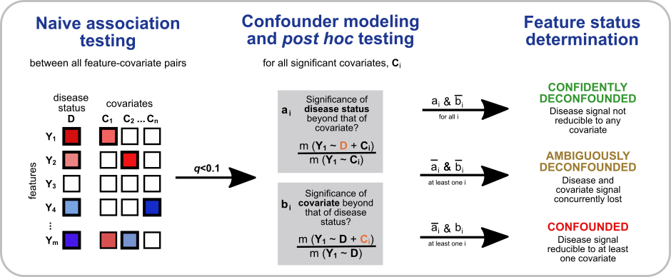
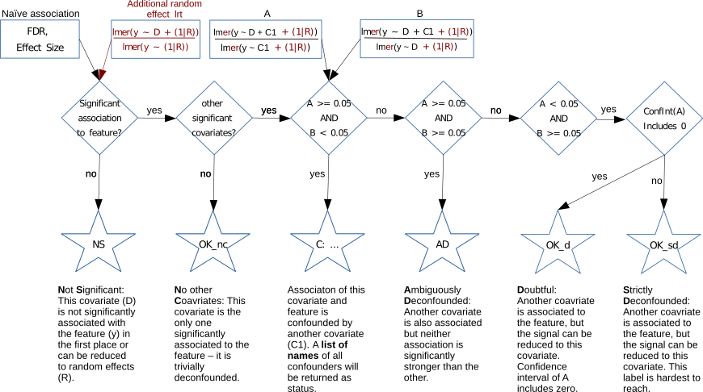

```{r setup, include = FALSE}
knitr::opts_chunk$set(
  collapse = TRUE,
  comment = "#>",
  fig.align = "center"
)
```


# Introduction

When analyzing multi omics datasets, the search for features that could
serve as biomarkers is an important aspect. Because these biomarkers
might be used in clinical settings for disease diagnosis etc., it is
extremely important to minimize false positives. One possible error
source are confounding variables: The biomarker is not directly linked
to the disease but influenced by a third (confounding) variable, that in
turn is linked to the disease.

The R package `metadeconfoundR` was developed to address this issue. It
first uses univariate statistics to find associations between omics
features and disease status or metadata. Using nested linear model
comparison post hoc testing, those associations are checked for
confounding effects from other covariates/metadata and a status label is
returned. Instead of assuming The tool is able to handle large scale
multi-omics datasets in a reasonable time, by parallel processing
suitable for high-performance computing clusters. In addition, results
can be summarized by a range of plotting functions.

## MetaDeconfound()

The main (`metadeconfoundR::MetaDeconfound()`) analysis is a two step
process:

```{r, echo=F, fig.cap = "Figure 1: metadeconfoundR pipeline overview.", out.width = "99%", dev = "png"}

```

First, significant associations between single omics features (like gut
microbial OTUs) and metadata (like disease status, drug administration,
BMI) are identified. Based on the data type of the respective metadata,
either `wilcox.test()` (for binary), `cor.test()` (for continuous
numerical) or `kruskal.test()` (for neither numerical nor binary) is
used. All three tests are rank-based to minimize assumptions about data
distribution (*Fig. 1*, left). In addition to collecting p-values for
all computed tests, effect size is measured as Cliff's Delta and
Spearman's Rho for binary and continuous data, respectively. Since there
is no suitable effect size metric for categorical data with more than 2
levels, no value is reported here. It is recommended to introduce binary
pseudo-variables for each level of the categorical metadata to partially
circumvent this drawback.

In the second step, all hits are checked for confounding effects and a
status is reported for each feature-metadata combination (*Fig. 1*,
center and right; *Fig. 2*). A "hit" here is defined as a
feature-metadata association with small enough fdr-corrected p-value and
big enough effect size reported from the first, naive part of the
pipeline. Thresholds for both parameters can be set via `QCutoff` and
`DCutoff` when starting the analysis. Since confounding of signal can
only happen with more than one metadata variable associated to a certain
feature, all features with only one significant metadata association are
trivially deconfounded and get status "No Covariates (OK_nc)".

The actual confounder detection is done by performing a set of two
likelihood ratio tests (LRTs) of nested linear models. For each possible
combination of a feature and two of its associated metavariables, three
models are fitted to the rank-transformed feature:

-   lm(rank(feature) \~ covariate1 + covariate2), the full model
-   lm(rank(feature) \~ covariate1), a model with only covariate1 as
    independent variable
-   lm(rank(feature) \~ covariate2), a model with only covariate2 as
    independent variable.

LRTs reveal whether inclusion of covariate1 and/or covariate2
significantly improves the performance of the model. Random and/or fixed
effects can be added to all models by the user. These additional effects
will, however, not be considered in the first naive association testing
step of the pipeline.

Importantly, `metadeconfoundR` will always **rank-transform the
features** during analysis.

```{r, echo=F, fig.show='hold', fig.cap = "Figure 2: detailed status labelling decision tree.", out.width = "99%", out.height = "99%", dev = "png"}

```

------------------------------------------------------------------------

# Quick start

```{r example, eval=FALSE, echo=TRUE, }
# CRAN 
install.packages("metadeconfoundR")
# github stable version
devtools::install_github("TillBirkner/metadeconfoundR")
# github developmental version
devtools::install_github("TillBirkner/metadeconfoundR@develop")
library(metadeconfoundR)
```

```{r hide, eval=TRUE, echo=FALSE, results="asis", results='hide', message=FALSE}
library(metadeconfoundR)
library(ggplot2)
library(gridExtra)
library(kableExtra)
```

------------------------------------------------------------------------

# MetaDeconfound()

## Input

Minimal input consists of two data.frames for feature data (*Tab. 1*)
and metadata (*Tab. 2*), respectively. Both data.frames must have one
row per sample (sample names as rownames) with matching order of
sampleIDs and one feature/meta-variable per column. The first column of
the metadata data.frame must be binary (i.e be numeric and consist of
only 0/1 entries.) Usually this is the control/case variable, but any
other binary meta-variable will work as well.

```{r showTableF, eval=TRUE,  echo=FALSE}
kbl(reduced_feature[10:15, 1:5], caption = "Table 1: feature input format example")
```

```{r showTableM, eval=TRUE, echo=FALSE}
kbl(metaMatMetformin[10:15, 1:5], caption = "Table 2: metadata input format example")
```

`MetaDeconfound()` has built-in quality checks for formatting of the
input data but it is best to check propper formatting beforehand.

Ensure that colnames and rownames do not contain any problematic
characters by e.g running them through `make.names()` and check for same
order of rows in both input data.frames.

```{r runExample, eval=TRUE, echo=TRUE, nobreak=TRUE}
data(reduced_feature)
data(metaMatMetformin)

# check correct ordering
all(rownames(metaMatMetformin) == rownames(reduced_feature))
all(order(rownames(metaMatMetformin)) == order(rownames(reduced_feature)))

example_output <- MetaDeconfound(
  featureMat = reduced_feature,
  metaMat = metaMatMetformin,
  returnLong = TRUE,
  logLevel = "ERROR"
)
```

**Random and/or fixed effects** can be included in the modeling process
by supplying the `randomVar` and/or `fixedVar` parameter (*Fig. 3,
right*).

```{r runExampleRand, eval=TRUE, echo=TRUE, nobreak=TRUE, message = FALSE}
RandDataset_output <- MetaDeconfound(
  featureMat = reduced_feature,
  metaMat = metaMatMetformin,
  randomVar = c("Dataset"),
  returnLong = TRUE,
  logLevel = "ERROR"
)
```

For a full list of input parameters please refer to the help page.

## Output

Output can be returned either as a list of wide format data.frames
(default) or as a single long format data.frame (*Tab. 3*). In both
cases raw p-values (Ps), multiple testing corrected p-values (Qs),
corresponding effect size (Ds), and confounding status (status) are
reported for each possible combination of a feature and a meta-variable.

While Ps, Qs, and Ds are always solely based on the naive association
testing, the status label reflects effects of included random/fixed
effects. A naively significant feature, metadata association that is
reducible to a random effect can, thus, have a Q-value \< `QCutoff` and
still be labeled as "NS" (not significant).

```{r showTableO, eval=TRUE, echo=FALSE}
kbl(example_output[1:5, 1:6], caption = "Table 3: example output of MetadDeconfound()")
```

## Mediation analysis

MetadeconfoundR can test for associations between to omics spaces, while
controlling for confounders/mediators. Simply supply a second data.frame
of features as `mediationMat` when running `MetaDeconfound()`. Note that
only metavariables supplied via `metaMat` will be tested as potential
confounders/mediators in this case, and multiple testing p-value
correction will be done for `ncol(featureMat)*ncol(mediationMat)` by
default, while p-values for the supplied metadata will not be corrected.
A different correction approach can be forced by setting the
`adjustLevel` argument accordingly.

```{r runMediation, eval=TRUE, echo=TRUE, nobreak=TRUE}
reduced_featureMedi <- reduced_feature[, 1:40]
mediationMat <- reduced_feature[, 41:50]

example_outputMedi <- MetaDeconfound(
  featureMat = reduced_featureMedi,
  metaMat = metaMatMetformin,
  mediationMat = mediationMat,
  returnLong = TRUE,
  logLevel = "ERROR"
)
```

When mediation analysis is performed, `MetaDeconfound()` will add an
additional "groupingVar" column to the final output. This column states
from which input data.frame a reported association originates: `metaMat`
or `mediationMat`. When supplying output from such a `MetaDeconfound()`
run to [BuildHeatmap()], this additional "groupingVar" information is
used to split the resulting plot, separating the `mediationMat` features
from the metadata.

```{r runMediPlot, echo=T, eval=FALSE}
BuildHeatmap(
  example_outputMedi,
  keepMeta = colnames(metaMatMetformin),
  d_range = "full"
) + 
  theme(strip.background = element_rect(fill = "red"))
```

```{r runMediPlotHidden, echo=F, fig.cap = "Figure 3: BuildHeatmap() output for mediation analysis data", fig.width = 4.5, fig.height=6 }
BuildHeatmap(
  example_outputMedi,
  keepMeta = colnames(metaMatMetformin),
  d_range = "full"
) + 
  theme(strip.background = element_rect(fill = "red"))
```

------------------------------------------------------------------------

# BuildHeatmap()

Minimal input consists only of an output object from the main
`MetaDeconfound()` function. This will return in a ggplot2 heatmap with
effect size as tile color and black asterisks or grey circles indicating
significant and not confounded or confounded associations based on
corrected p-values. The plot is clustered on both axes and features as
well as meta-variables without any associations passing effect size and
significance cutoffs (default: `q_cutoff = 0.1`, `d_cutoff = 0.01`) are
removed (*Fig. 4*).

```{r runHeatmap, echo=T, eval=FALSE}
left <- BuildHeatmap(example_output)
right <- BuildHeatmap(RandDataset_output)
grid.arrange(left, right, ncol = 2)
```

```{r runHeatmapHidden, echo=F, fig.cap = "Figure 4: default output of the BuildHeatmap() function", fig.width = 5.5, fig.height=6 }
left <- BuildHeatmap(example_output) + labs(title = "example_output")
right <- BuildHeatmap(RandDataset_output)  + labs(title = "RandDataset_output")
grid.arrange(left, right, ncol = 2)
```

## options

For both this default heatmap, as well as the alternative cuneiform plot (`cuneiform = TRUE`), a range of customizations are available. In *Fig. 5* meta-variables not passing the effect size and significance cutoffs are manually kept in the plot (`keepMeta`), and the shown range of effect sizes is set from -1 to +1 (`d_range = "full"`). For a full list of options, again, refer to the help page.

```{r runCun, echo=T, eval=FALSE}
BuildHeatmap(
  example_output,
  cuneiform = TRUE,
  keepMeta = colnames(metaMatMetformin),
  d_range = "full"
)
```

```{r runCunHidden, echo=F, fig.cap = "Figure 5: alternative cuneiform output of the BuildHeatmap() function", fig.width = 3.5, fig.height=6 }
BuildHeatmap(example_output, cuneiform = TRUE, keepMeta = colnames(metaMatMetformin), d_range = "full")
```

## ggplot2 options

The `BuildHeatmap()` function returns a ggplot2 object. This makes it
possible to perform some easy alterations manually (*Fig. 6*).

```{r runpostCustom, echo=T, fig.cap = "Figure 6: post-plotting ggplot2 alterations", fig.width = 1.9, fig.height=6 }
BuildHeatmap(example_output) +
  theme(
    legend.position = "none",
    axis.text.y = element_text(face = "italic"),
    plot.title = element_blank(),
    plot.subtitle = element_blank()
  )
```

## Grouping of metadata

An additional column "groupingVar" can be added to the long format
`MetaDeconfound()` output, containing a set of group names. It can be
used to separate the supplied metavariables into different groups. When
running [Mediation analysis], this column gets added automatically, so
that features from `mediationMat` are clearly separated from the
metavariables of `metaMat` in the `BuildHeatmap()` output. This
splitting is based on `ggplot2::facet_grid()`, which allows for similar
customizations through the `ggplot2::theme()` function as the main plot.
The order of the groups in the resulting plot can be changed by editing
the order of factor levels of the groupingVar column.

------------------------------------------------------------------------

# BuildConfounderMap()

Minimal input consists only of an output object from the main
`MetaDeconfound()` function. This will return in a list of ggplot2/ggrpah circos plots with one plot per input feature. All metavariables significantly associated to the respective feature are shown as circles with filling color and line thickness depicted as effect size and confounding status, respectively. The confounder-confounded relationship between the metavariables are shown as directional lines connecting them. 
```{r runBuildConfounderMap, echo=T, fig.cap = "Figure 7: BuildConfounderMap() example plot", fig.width = 4, fig.height=4 }
plotObject <- BuildConfounderMap(example_output)
library(ggraph)
plotObject$MS0001
```

------------------------------------------------------------------------

# importLongPrior()

The function `ImportLongPrior()` of the metadeconfoundR package allows
for easy integration of a list of feature-metadata pairings into a new
run of the main `Metadeconfound()` function.

These pairings must be supplied in the form of a long-format data.frame
with the first column called "feature" containing names of omics
features and the second column called "metaVariable" containing names of
the respective associated metadata variable. When only these two columns
are used as input for `ImportLongPrior()`, all given pairings are
assumed to be significant.

Additional columns called "Qs" and "status", as produced by
metadeconfoundR can also be supplied.:

```{r produceLongOut, eval=FALSE}
print(example_output[101:105, ])
```

```{r headLongInput, echo=FALSE}
knitr::kable(example_output[101:105, ])
```

Whenever the "status" column is part of the input, only
feature--metadata pairings having a status other than "NS" are assumed
to be significant.

To assure only features and metadata present in the current dataset are
imported, the two input data.frames for the `Metadeconfound()` function,
featureMat and metaMat, also need to be supplied to `ImportLongPrior()`.
It is therefore important to have consistent naming of variables between
datasets.

```{r runImportLongPrior}

minQValues <- ImportLongPrior(longPrior = example_output,
                                featureMat = reduced_feature,
                                metaMat = metaMatMetformin)
```

In any case, `ImportLongPrior()` will return a wide-format data.frame
containing significance values for the supplied pairings. If a "Qs"
column was part of the longPrior input, these multiple-testing corrected
p-values will be used for the output. If no "Qs" was supplied,
artificial "significant" values of -1 will be used to mark significant
associations.

```{r fakeshowminQ, eval=FALSE}
print(minQValues[1:5, 1:5])
```

```{r showminQValues, echo=FALSE}
knitr::kable(minQValues[1:5, 1:5])
```

This data.frame can now be used as the `minQValues` input parameter of
`MetaDeconfound()`.

```{r runInformedMetadeconf, eval=FALSE}

example_output2 <- MetaDeconfound(featureMat = reduced_feature,
                                  metaMat = metaMatMetformin,
                                  minQValues = minQValues)
```

This way, all significant feature--metadata pairings in the `minQValues`
data.frame will be treated as potential confounders in
`MetaDeconfound()`.

Note that this example is only to demonstrate the general process of
integrating prior knowledge into a `MetaDeconfound()` analysis. Using
the output of a `MetaDeconfound()` run as `minQValues` input for a
second run with the exact same features and metadata will not lead to
any new insights since the set of QValues calculated by
`MetaDeconfound()` and the set supplied using the `minQValues` parameter
are identical in this case.

------------------------------------------------------------------------

# GetPartialEfSizes()

Effect sizes returned by `MetaDeconfound()` are marginal effect sizes
based on naive associations, and so do not take into account potential
confounders. These marginal effect sizes can, therefore, be inflated and
might not reflect the true effect size attributable exclusively to a
metavariable. However, building large models including all available
metavariables in order to compute partial effect sizes is neither
feasible nor robust. Instead, we first run a normal `MetaDeconfound()`
analysis. Subsequently, we supply the output from that run to
`GetPartialEfSizes()`. This function calculates a partial effect size
only for those metavariables labeled not as "NS" (not significant).
Random and/or fixed effects used in the `MetaDeconfound()` analysis need
to be supplied here again, alongside the original input data.frames.

For each feature, a full linear model with all identified metavariables
as predictors is being built alongside a set of smaller models, each
missing one of the metavariables. The partial R² is calculated as the
difference in the coefficient of determination ("R²") between the full
model and one of the reduced models that excludes the respective
metavariable.

These values as well as two different normalizations are reported in
three new columns:

-   "partial" is the raw partial R² (R²(full) - R²(reduced)) -- it shows
    how much of the variance of a feature can only be explained by the
    respective metavariable.
-   "partialRel" is calculated as ratio of partial R² to R² of the full
    model -- it shows how much of the overall explainable variance of a
    feature is explained by the respective metavariable.
-   "partialNorm" is calculated as ratio of partial R² to (1 - R² of the
    smaller model) -- it shows how much of the not otherwise explainable
    variance of the feature can be explained by the respective
    metavariable, or how much of it's explanatory potential a
    metavariable reaches.

Finally, the sign of the marginal effect size, i.e. the direction of the
association, is transferred to the partial effect size, and the R² of
the full model ("maxRsq") is appended for each feature.

```{r runPartial, eval=TRUE, echo=TRUE, nobreak=TRUE, message=FALSE}
ex_out_partial <- GetPartialEfSizes(
  featureMat = reduced_feature,
  metaMat = metaMatMetformin,
  metaDeconfOutput = RandDataset_output,
  randomVar = c("Dataset")
)
```

```{r runPartialPlotting, eval=TRUE, echo=FALSE, message=FALSE, fig.width = 4.5, fig.height=5, fig.cap="Figure 8: BuildHeatmap() plotting of partial effect sizes calculated by GetPartialEfSizes()"}

partialHM_Rand <- BuildHeatmap(ex_out_partial,
                               plotPartial = "partial",
                               reOrder = "none",
                               keepMeta = colnames(metaMatMetformin),
                               d_range = "full",
                               d_cutoff = 0.0000001
                               ) +
  labs(title = "partial", subtitle = "") +
  theme(legend.position = "none",
        plot.title = element_text(hjust = 0.6),
        axis.title.x = element_blank()
        )
partialRelHM_Rand <- BuildHeatmap(ex_out_partial,
                                  plotPartial = "partialRel",
                                  reOrder = "none",
                                  keepMeta = colnames(metaMatMetformin),
                                  d_range = "full",
                                  d_cutoff = 0.0000001
                                  ) +
  labs(title = "partialRel", subtitle = "") +
  theme(legend.position = "none",
        plot.title = element_text(hjust = 0.6),
        axis.title.x = element_blank()
        )
partialNormHM_Rand <- BuildHeatmap(ex_out_partial,
                                   plotPartial = "partialNorm",
                                   reOrder = "none",
                                   keepMeta = colnames(metaMatMetformin),
                                   d_range = "full",
                                   d_cutoff = 0.0000001
                                   ) +
  labs(title = "partialNorm", subtitle = "") +
  theme(legend.position = "none",
        plot.title = element_text(hjust = 0.6),
        axis.title.x = element_blank()
        )

grid.arrange(
  partialHM_Rand,
  partialRelHM_Rand,
  partialNormHM_Rand,
  nrow = 1,
  widths = c(1.05, 1, 1)
)
```

------------------------------------------------------------------------

# Session Info

```{r sessionInfo, results="asis", echo=FALSE}
pander::pander(sessionInfo())
```
